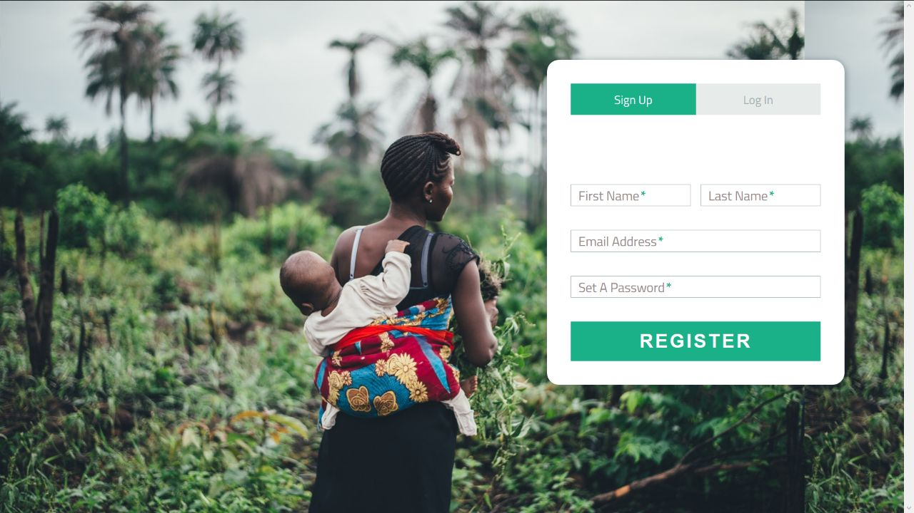

Challenge: "Solutions for Urban City Problems Using Facebook Technologies" (issues such as transport, security etc.)  

Code For A Cause Impact Award Challenge: Build technology that solves a social or environmental problem and positively impacts your local community.  

# wajaWazito
 
Wajawazito is a name for expectant ladies in Swahili.  
We've done our research within the 30hrs we had on 5 women and on average an expectant ladies go  through atleast 14 visits to the hospitals and they have all sorts of complains of the system some say they queue on long lines, doctors want to achieve their daily target cash by serving them fast thus rush and unsatisfactory treatment by attending doctors. 
It's basically a platform that provides a medical track for pregnant ladies right on their door step at pocket friendly prices through the power of crowd funding.Our main target being the low class and middle class women to experience professional treatment and track that only the rich experience.  

We are targeting mostly the low income and middle  class people who somehow struggle to get this required  professional services that foster successful deliveries thus decrease maternal death rates in Kenya. 
On top of that we are trying to reduce this unemployment rate of our qualified doctors by providing cost free consultancies by doctors and cost friendly and professional services to wajawazitos(pregnant mums).  
 
# Problems we are solving: 

Maternal deaths - this deaths were relatively high in the past 8 years but with the government initiative to solve this by free birth for nhif covered mother's greatly reduced the numbers with our platform we hope to reduce this numbers more through  this cost friendly platform to even the smallest mama mboga. 
 
Unemployment of doctors- according to kmpdu 1400 interns are unemployed yet the government wanted to import like 100 doctors from Cuba and earlier on during the strike they wanted to employ Tanzanian doctors... I don't know if they don't have the required skill set or the system just does not have space for Kenyan made skills.
 
Cost efficient and professional services-
 
# Where is the money?  
We have a lot of income generating channels the main one being through after pregnancy related products advertisements like...... 
We believe sincee our platform will have a large traffic of pregnant women it will be the best platform for  baby reated companies to sell their products through our platform and at discount prices due to large traffic. 
 
Another being a stipend amount from each organised treatment arranged through our platform since payment and paying are all handled through the system.  
Just to mention a few
  
# Technologies used 
Through our research we've realised many pregnant women seek assistance through popular groups in facebook. So we've based our audience reach through facebook where parents or pregnant mums can freely and happily advise other pregnant moms and the services we offer through self exposure through our system just generating alot of traffic and referrals for our system. Among the services include social facebook login and most importantly custom made sharing facility through our website to facebook.
Another concept applied is the use of easy and popular  payment methods through mpesa and the visa apis which translate smooth payments of products we offer through our platform. 
  
# What's the future or vision of wajawazito 
We aim at delivering not just an information service but a community of pregnant  women and women who were pregnant but constantly referring there pregnant peers to our system and actively providing advices to expectant ladies. 

# ScreenShot

 

 

 
